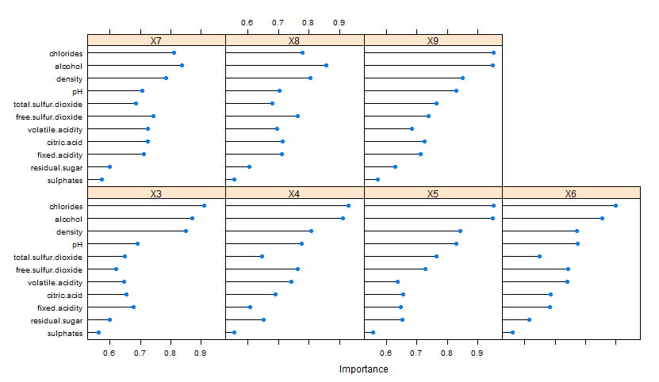

<center> <h1>Project Overview</h1> </center>

<br>

<p style='text-align: justify;'>
&nbsp;&nbsp;&nbsp;&nbsp;&nbsp;&nbsp;In this project I  will use the R language to apply exploratory data analysis techniques to a dataset containing information about chemical properties of Red Wines, trying to answer the guideline question: **"Which chemical properties influence the quality of red wines"**? Exploratory Data Analysis (EDA) is the numerical and graphical examination of data characteristics and relationships before formal, rigorous statistical analyses are applied.
</p>

<p style='text-align: justify;'>
&nbsp;&nbsp;&nbsp;&nbsp;&nbsp;&nbsp;The main goal of this project is to document an EDA process from scratch, threrefore, it is not to be seen (and won't be presented) as a "final report" you'd present to a possible stakeholder. **As the project description  states (and I quote):** *"Plots in this analysis do not need to be polished with labels, units, and titles; these plots are exploratory (quick and dirty). They should, however, be of the appropriate type and effectively convey the information you glean from them - You can iterate on a plot in the same R chunk, but you don't need to show every plot iteration in your analysis."* </p>

<p style='text-align: justify;'>
&nbsp;&nbsp;&nbsp;&nbsp;&nbsp;&nbsp; Towards the end of this report there will be a "Final Plots and Summary" section where I selected three plots from the analysis to polish and share with more insights.
</p>

<p style='text-align: justify;'>&nbsp;&nbsp;&nbsp;&nbsp;&nbsp;&nbsp;This project is divided in the following sections:

1. Dataset: Contains an overview of the dataset used and an explanation of each one of its variable. 
2. Exploratory Data Analysis: Where I explore at the data from several different angles.
2. Final Plots and Summary: Where three plots from the analysis were selected to be polished and shared with more insights.
3. Reflection: Reflection about dificulties, sucesses on the project and possible next steps.
</p>

<br>

## The DataSet

<p style='text-align: justify;'>
&nbsp;&nbsp;&nbsp;&nbsp;&nbsp;&nbsp;This tidy data set contains 1,599 observation  of red wines with 11 variables on it's chemical properties. The inputs include objective tests (e.g. PH values) and the output is based on sensory data (median of at least 3 evaluations made by wine experts). Each expert graded the wine quality between 0 (very bad) and 10 (very excellent).
</p>

<br>

###Attributes description:

1. **fixed acidity (tartaric acid - g / dm^3):** most acids involved with wine or fixed or non-volatile (do not evaporate readily)
2. **volatile acidity(acetic acid - g / dm^3):** the amount of acetic acid in wine, which at too high of levels can lead to an unpleasant, vinegar taste
3. **citric acid(g / dm^3):** found in small quantities, citric acid can add 'freshness' and flavour to wines
4. **residual sugar(g / dm^3):** the amount of sugar remaining after fermentation stops, it's rare to find wines with less than 1 gram/litter and wines with greater than 45 grams/litter are considered sweet
5. **chlorides(sodium chloride - g / dm^3:** the amount of salt in the wine
6. **free sulphur dioxide(mg / dm^3):** the free form of SO2 exists in equilibrium between molecular SO2 (as a dissolved gas) and bisulfide ion; it prevents microbial growth and the oxidation of wine
7. **total sulphur dioxide(mg / dm^3):** amount of free and bound forms of S02; in low concentrations, SO2 is mostly undetectable in wine, but at free SO2 concentrations over 50 ppm, SO2 becomes evident in the nose and taste of wine
8. **density(g / cm^3):** the density of water is close to that of water depending on the percent alcohol and sugar content
9. **pH:** describes how acidic or basic a wine is on a scale from 0 (very acidic) to 14 (very basic); most wines are between 3-4 on the pH scale
10. **sulphates(potassium sulphate - g / dm3):** a wine additive which can contribute to sulphur dioxide gas (S02) levels, which acts as an antimicrobial and antioxidant
11. **alcohol(% by volume):** the percent alcohol content of the wine
12. **quality:** Output variable based on sensory data(score between 0 and 10)


```{r, echo=FALSE, include=FALSE}
setwd("C:/git/UdacityDataAnalystNanoDegree/4_R/FinalProject/")
df<-read.csv("wineQualityWhites.csv")
library(plyr)
library(dplyr)
library(sfsmisc)
library(reshape2 )
library(ggplot2)
library(gridExtra)
library (corrplot)
library(caret)
library(rpart)
library(rpart.plot)
```

<br>
<br>

##Exploratory Data Analysis

<p style='text-align: justify;'>
&nbsp;&nbsp;&nbsp;&nbsp;&nbsp;&nbsp;Looking at the data, the first thing that caught my attention was that the quality variable (the one we are mainly trying to understand) is begin stored as an integer - which is not good because even though it is intuitive that the higher is the value, the higher is the quality; it doesn't necessary mean that a quality 4 wine is twice as good as a quality 2 wine and twice as bad as a quality 8 - it's just a numeric scale, so I transformed it to a factor.
By the way, from this point on I will refer to "quality X wines" simply as QX to save space.
</p>

<p style='text-align: justify;'>
&nbsp;&nbsp;&nbsp;&nbsp;&nbsp;&nbsp;
I also added a "rating" field to the dataset simply by grouping all wines whose quality is less than 5 into "Bad", between 6 and 7 into "Average", 8 into "Good" and 9 into "Excellent".
</p>
```{r}
df$rating <- ifelse(df$quality <= 5, 'Bad', 
                    ifelse(df$quality <= 7, 'Average', 
                           ifelse(df$quality<=8,'Good', 
                                  'Excellent'
                           )
                    )
)

df$rating <- ordered(df$rating,levels = 
                       c('Bad', 'Average', 'Good', 'Excellent'))
df$quality <- as.factor(df$quality)
```


<p style='text-align: justify;'>
&nbsp;&nbsp;&nbsp;&nbsp;&nbsp;&nbsp;
My second step was to see how many observation of each wine quality do we have by creating a histogram on the quality variable and for comparisson, on the rating variable:
</p>


```{r}
p1 <- ggplot(data=df,aes(x=quality))+
  geom_bar(aes(y = (..count..)),fill="orange")+
  geom_text(aes(y = (..count..),label =   ifelse((..count..)==0,"",
        scales::percent((..count..)/sum(..count..)))), 
        stat="bin",colour="darkgreen")

p2 <- ggplot(data=df,aes(x=rating))+
  geom_bar(aes(y = (..count..)),fill="orange")+
  geom_text(aes(y = (..count..),label =   ifelse((..count..)==0,"",
        scales::percent((..count..)/sum(..count..)))), 
        stat="bin",colour="darkgreen")

grid.arrange (p1,p2, ncol=2)
```


<p style='text-align: justify;'>
&nbsp;&nbsp;&nbsp;&nbsp;&nbsp;&nbsp;
The fact that the data is not evenly distributes (it's actually normally distributed) is a bad thing to us because we have very few observations on the tails - meaning that its quite hard to identify an "excellent" wine when they only appear on 0.1% of your dataset (5 observations). We can also see that there are no Q1, Q2 or Q10 wines on this dataset.
</p>


<br>

####Single variable Analysis

<p style='text-align: justify;'>
&nbsp;&nbsp;&nbsp;&nbsp;&nbsp;&nbsp;The next step was to analyse the variables individually inside each wine quality by plotting  boxplots and bar charts for each one of them. **Important note:** To avoid plotting 18 charts here, I summarized then in two big plots. I understand that they may look squeezed together but while trying to fit on the screen but bear in mind that I initially looked at them individually.
</p>

<p style='text-align: justify;'>
&nbsp;&nbsp;&nbsp;&nbsp;&nbsp;&nbsp;
I used the boxplots mainly to get an idea of the data range and to find potential outliers:
</p>


```{r, echo=FALSE,  fig.width = 12, fig.height = 16}

melt_data <- melt(df[ ,!(colnames(df) == "rating")],id.vars=c("X","quality"))


plots <- dlply(melt_data,.(variable),function(chunk)
{
  ggplot(data=chunk, aes(x=factor(quality), y = value)) + geom_boxplot() + 
    stat_summary(fun.y=mean,geom = 'point', shape = 4) + 
    labs(y=unique(chunk$variable))
})

do.call(grid.arrange,c(plots,ncol=2))
```


<p style='text-align: justify;'>
&nbsp;&nbsp;&nbsp;&nbsp;&nbsp;&nbsp;Here are the results:

1. **fixed acidity:**  very few outliers; 
2. **volatile acidity:** 160 outliers but only over the upper outer fence;
3. **citric acid:** 220 outliers over the upper outer fence; a few bellow the lower outer fence;  quite a few values close to 0 - specially on Q4 and Q5 wines - is this an indication of poor wine quality?;
4. **residual sugar:** almost no outliers, except for observation 2782 which has a value of 65 when the upper whisker (disregarding quality) is 22; that is clearly an erroneous observation on Q6 so I decided to remove it from the dataset to avoid having to filter it from now on;
5. **chlorides:** 160 outliers but only over the upper outer fence;
6. **free sulfur dioxide:** no outliers;
7. **total sulfur dioxide:** no outliers;
8. **density:** no outliers;
9. **pH:** very few outliers;
10. **sulphates:** 150 outliers but only over the upper outer fence;
11. **alcohol:** no outliers;

<p style='text-align: justify;'>
&nbsp;&nbsp;&nbsp;&nbsp;&nbsp;&nbsp;From this point the "X"(Observation unique Identifier) wont be necessary anymore, so I'll just remove it
</p>


```{r, echo=FALSE}
df<- df[!df$X == 2782, ]
df[,c("X")] <- list(NULL)

```

<br>
<p style='text-align: justify;'>
&nbsp;&nbsp;&nbsp;&nbsp;&nbsp;&nbsp;I also used bar plots to visualise the average of each measure on different wine qualities. This has proven to be a much more interesting analysis as I could, among other things, plot a trend line to see how the average "behave" between different wine qualities.
</p>


```{r, echo=FALSE,  fig.width = 12, fig.height = 16}
plots <- dlply(melt_data,.(variable),function(chunk)
{
  ggplot(data= chunk) +  aes(x = factor(quality), y = value)+
    stat_summary(aes(fill = factor(quality)), fun.y=mean, geom="bar")+
    stat_summary(aes(label=round(..y..,2)), fun.y=mean, 
                 geom="text", size=6, vjust = 1)  +  
    labs(y=unique(chunk$variable)) + theme(legend.position="none") +
    geom_smooth(method = "lm", se=FALSE, color="black", 
                type='dotted', aes(group=1), size =1,lty = 2)
    
})
do.call(grid.arrange,c(plots,ncol=2))
```


<br>
<p style='text-align: justify;'>
&nbsp;&nbsp;&nbsp;&nbsp;&nbsp;&nbsp;Here are the results:
</p>

1. **fixed.acidity:** This seems to be a tricky one, as the average quantity decreases, the quality seems to increase, except for Q9 where it is higher than Q4. So I went back to the fixed.acidity boxplot on Q9 and saw that there is an outlier (observation 775), which I tried to remove it to see it if affects the report, but even though it brought the average down to 7, it still maintains the same behaviour we are seeing.

2. **volatile.acidity:** We seem to be getting better wines with less acidity, but again, even though the average decreases from Q4 to Q7, it slightly increases on Q8 and Q9 .

3. **citric.acid:** I this case is undeniable that more acid wines are considered better wines.

4. **residual.sugar:** Looking at sugar we seem to have a trend where less sugary wines seem to be classified as better (even though Q7 is not as right as I would expect). Interesting the drop from Q8 to Q9 and the fact that Q9's average is closer to Q4's average than Q8 average.

5. **chlorides:** Clearly follows a descending patter, where we'd be looking for less chlorides to get a better wine.

6. **free.sulfur.dioxide:** Too much is correlated with a very bad wine (Q3) where too little is not good either (Q4). Pretty static otherwise, anything between 36.4 and 33.4 is good, the latter being ideal.

7. **total.sulfur.dioxide:** "Ddescending" pattern similar to the one found on residual sugar. Looking at the two graphs I'd expect that these two variables are correlated (and in fact they are, I'll show latter that their correlation is 0.4)

8. **density:** Doesn't seem to matter that much, the difference between worst and best being 0.0034.

9. **pH:** I see a tendency of having better quality with higher PH (not very steep though).                  

10. **alcohol:** Same behaviour as pH, only in this case the slope seems to be bigger.

11. **sulphates:**  this is a tricky one, from  Q3 to Q7 we seem to be getting better quality as the number of sulphates increases, which doesn't hold true for Q8 and Q9.


<br>

<p style='text-align: justify;'>
&nbsp;&nbsp;&nbsp;&nbsp;&nbsp;&nbsp;At this point, even though I got an idea of each variable relationship with average quality, I wanted to expand this analysis a little trying to find out how much of the wine's quality is explained by each individual variable.
In order to do that, I choose to run a simple linear regression between quality and each one of the variables.
</p>

<p style='text-align: justify;'>
&nbsp;&nbsp;&nbsp;&nbsp;&nbsp;&nbsp;It's important to reinstate that since "wine quality" is a factor (a categorical variable), it doesn't make sense to talk about correlation between it and the variables because it doesn't have a numerical value that can go up and down. 
But there are measures of strength of association we can use that are somewhat analogous. 
As an example, let's look at the "alcohol" variable. By using "alcohol" as the reference level for "Quality", we can perform a regression.
</p>

```{r}
model.lm <- lm(alcohol ~ quality, data =df)
summary(model.lm)
```


<p style='text-align: justify;'>
&nbsp;&nbsp;&nbsp;&nbsp;&nbsp;&nbsp;We can interpret the estimated intercept as the mean "alcohol" on Q3 wines as 10.3450 (% by volume), and the estimated coefficients for the subsequent qualities as showing how much it changed compared with Q3.
For example, the estimate on Q4 is showing it having on average -0.1925 (% by volume) less than Q3 and the coefficient on Q9 shows it having 1.8350 (% by volume) more than "quality 3" and so on. It's important to note that the coefficient of determination R2=0.2199 is quite small (one interpretation it is that this model explains only 22% of variance). 
</p>

<p style='text-align: justify;'>
&nbsp;&nbsp;&nbsp;&nbsp;&nbsp;&nbsp;Note that 0.2199 isn't the **correlation** between "alcohol" and "quality" - we can't correlate those two variables because quality is categorical. What it actually represents is the correlation between the observed values for alcohol, and the ones predicted (fitted) by the model. Both of these variables are numerical so we are able to correlate them. In fact the fitted values are just the mean durations for each group:
</p>

```{r}
#Q3 average quality
mean((subset(df, quality == 3))$alcohol)

#Q4 average quality
mean((subset(df, quality == 4))$alcohol)

#The coeficinet for Q4 is the mean differnece from Q3
mean((subset(df, quality == 4))$alcohol)-
  mean((subset(df, quality == 3))$alcohol)
```


<p style='text-align: justify;'>
&nbsp;&nbsp;&nbsp;&nbsp;&nbsp;&nbsp;And the fitted values are nothing more than the coeficient for a particullar quality of the wine added with Q3's (base) coeficient. We can easily see that if we look at observation 4898: Its fitted value (10.57486) is the Q3's average 10.3450 plus 0.2299  (the coefficient from its wine quality Q6)
</p>


```{r}
tail(model.lm$fitted)
tail(select(df, alcohol, quality))
```

<br>

<p style='text-align: justify;'>
&nbsp;&nbsp;&nbsp;&nbsp;&nbsp;&nbsp; But that was only one variable. Bellow I run a similar code to output the coefficients of all measures on the same grid. On the last line I add the R2 for that particular measure. I am abreviating the titles to fit the result on the screen. In the end, I am printing them just for clarification.
</p>


```{r, warning=FALSE}
fit_model <- function(variable, data, name)
{
  model.lm <- lm(variable ~ quality, data = data) #run the regression
  s<-summary(model.lm)
  x<-as.data.frame(round(s$coefficients[,1],4)) #get the coeficients from the summary
  names(x) <- abbreviate(name,4, method = c("left.kept")) # name the column
  rsq <- round(summary(model.lm)$r.squared,4) #get r-squared
  x<-rbind(x,rsq)  #and add it to the data frame
  rownames(x)[8] <-"r-squared"  #name the row
  x
}

grid <- NULL
i = 1
for(n in names(df))
{  
  if (n != 'quality') {
    if (is.null(grid)){
      grid<-fit_model(df[,i], df, n)
    } else {
      grid<-cbind(grid,fit_model(df[,i], df, n) )
    }
    i = i+1  
  }
}

grid

names(df)
```


<p style='text-align: justify;'>
&nbsp;&nbsp;&nbsp;&nbsp;&nbsp;&nbsp; 
Looking at the r-squares we can see that no measure by itself explains much of the model. 
Actually, alcohol and density are the two variables that individually explain more about the model (22% and 12% respectively) followed by acidity with 7% and chlorides with roughly 5%. 
</p>


<br>
<br>

####Dual variable Analysis (correlation)

<p style='text-align: justify;'>
&nbsp;&nbsp;&nbsp;&nbsp;&nbsp;&nbsp;I started analysing the correlation between all the variables by plotting the full matrix where on the top right we can see the correlation strength coloured (darker blue meaning higher correlation - positive or negative) and on the symmetric bottom left only the values (I am rounding the correlation to 2 decimal places only on the graph to make visualization easier: 
</p>


```{r, fig.width = 8, fig.height = 8, warning=FALSE}
col1 <- colorRampPalette(c("#00007F","blue","#007FFF",
            "cyan","white", "cyan", "#007FFF", "blue","#00007F"))
c<-cor(select(df, -quality, -rating))
c2 <-round(c, digits=2)


corrplot(c2, method="color", col=col1(20), cl.length=21,order = "AOE", 
         addCoef.col="grey", tl.srt=45,tl.col="black")
corrplot(c,add=TRUE, type="lower", method="number",order="AOE",
         col="black",         diag=FALSE,tl.pos="n", cl.pos="n", tl.srt=45)

```


<p style='text-align: justify;'>
&nbsp;&nbsp;&nbsp;&nbsp;&nbsp;&nbsp;We can straight away see that the top correlations are:

1. alcohol and residual.sugar: -0.46
2. alcohol and chlorides: -0.36
3. alcohol and total.sulfur.dioxide: -0.45
4. alcohol and density: -0.8
5. total.sulfur.dioxide and residual.sugar: 0.41
6. total.sulfur.dioxide and free.sulfur.dioxide: 0.62
7. total.sulfur.dioxide and density: 0.54
8. density and residual.sugar:  0.83
9. pH and fixed.acidity:  -0.43
</p>

<br>
<p style='text-align: justify;'>
&nbsp;&nbsp;&nbsp;&nbsp;&nbsp;&nbsp;And this is the number of times each variable is "moderately correlated (> 0.35 or < -0.35)" with another: alcohol: 4; total.sulfur.dioxide: 4; residual.sugar: 3; density: 3; free.sulfur.dioxide: 1; fixed.acidity: 1; pH: 1; 
chlorides: 1;
</p>
<br>
<p style='text-align: justify;'>
&nbsp;&nbsp;&nbsp;&nbsp;&nbsp;&nbsp; Just to be sure I'm not missing any other type of correlation, I am plotting the least correlated pair of variables (free.sulfur.dioxide and pH) and for comparison, the most correlated variables (residual.sugar and density) on the side.
</p>


```{r, warning=FALSE, fig.width = 12, message=FALSE}
lesscorrelated<- ggplot(aes(x = free.sulfur.dioxide, y = pH), data=df) + 
                  geom_point()+
                  geom_smooth(method = 'auto', color = 'red')+
                  xlim(0, quantile(df$free.sulfur.dioxide,0.99)) 
  

morecorrelated<- ggplot(aes(x = residual.sugar, y = density), data=df) + 
                geom_point()+ geom_smooth(, color = 'red') +
                xlim(0, quantile(df$residual.sugar,0.99)) 

grid.arrange(lesscorrelated, morecorrelated, ncol=2)
```

<p style='text-align: justify;'>
&nbsp;&nbsp;&nbsp;&nbsp;&nbsp;&nbsp; Looking at the plot on the left there does not seem to be any connection, linear or non-linear between pH and free sulfur dioxide. On the right side, we do see the positive correlation between sugar and density, which is expected according to the [brix scale](https://en.wikipedia.org/wiki/Brix) (as the sugar content increases, the density increases)
</p>
<br>


####Plotting the top correlations:

<p style='text-align: justify;'>
&nbsp;&nbsp;&nbsp;&nbsp;&nbsp;&nbsp;Based on the values above, lets see how the most correlated variables behave among each other. 
</p>

<br>
**With Alcohol:**
```{r, fig.width = 12, fig.height = 12, warning=FALSE, message=FALSE}
p1<-ggplot(aes(x =  log10(alcohol), y =log10(residual.sugar) ), data=df) + 
  geom_point() +
  geom_smooth(method = 'auto', color = 'red')

p2<-ggplot(aes(x =  log10(alcohol), y =log10(chlorides) ), data=df) + 
  geom_point() +
  geom_smooth(method = 'auto', color = 'blue')  

p3<-ggplot(aes(x =  log10(alcohol), y =log10(density) ), data=df) + 
  geom_point() +
  geom_smooth(method = 'auto', color = 'orange')  

p4<-ggplot(aes(x =  log10(alcohol), y =log10(total.sulfur.dioxide) ),
           data=df) + geom_point() +
  geom_smooth(method = 'auto', color = 'violet')  

grid.arrange(p1,p2,p3,p4, ncol=2)
```
  
<br>
**With Total Sulfur Dioxide:**
```{r, fig.width = 10, fig.height = 10, warning=FALSE, message=FALSE}
p1<-ggplot(aes(x =  log10(total.sulfur.dioxide), y =log10(residual.sugar) ),
      data=df) + geom_point() +geom_smooth(method = 'auto', color = 'red')

p2<-ggplot(aes(x =  log10(total.sulfur.dioxide), y =log10(free.sulfur.dioxide) ), 
      data=df) +  geom_point() +geom_smooth(method = 'auto', color = 'blue')  

p3<-ggplot(aes(x =  log10(total.sulfur.dioxide), y =log10(density) ), 
      data=df) +   geom_point() +  
      geom_smooth(method = 'auto', color = 'violet')  

p4<-ggplot(aes(x =  log10(total.sulfur.dioxide), y =log10(alcohol) ), 
      data=df) + geom_point() +
  geom_smooth(method = 'auto', color = 'orange')  

grid.arrange(p1,p2,p3,p4, ncol=2)
```

<br>
**Density and residual.sugar:**
```{r, fig.width = 12, fig.height = 6, warning=FALSE, message=FALSE}
ggplot(aes(x =  log10(residual.sugar), y = log10(density)), data=df) + 
  geom_point() +
  geom_smooth(method = 'auto', color = 'red')  
```

<br>
**pH and fixed.acidity*:*
```{r, fig.width = 12, fig.height = 5, warning=FALSE, message=FALSE}
#pH and fixed.acidity:  -0.426296256
ggplot(aes(x =  log10(pH), y = log10(fixed.acidity)), data=df) + 
  geom_point() +
  geom_smooth(method = 'auto', color = 'red')  
```


<p style='text-align: justify;'>
&nbsp;&nbsp;&nbsp;&nbsp;&nbsp;&nbsp; The strongest correleation I found was between density and residual.sugar (0.83) followed by density and alcohol (-0.8). Alcohol is in fact, one of the most correlated variable on the dataset. If we look at the plots, we can easily see that the relashionship between density and alcohol for example follow a descending pattern.
</p>

<p style='text-align: justify;'>
&nbsp;&nbsp;&nbsp;&nbsp;&nbsp;&nbsp;One very interesting thing I noticed is on the relashionship between sugar and density. If we look at the plot we can see that it seem to follow a linear relashionship until a certain point and them spikes into what will probably become an exponential growth.
</p>

<p style='text-align: justify;'>
&nbsp;&nbsp;&nbsp;&nbsp;&nbsp;&nbsp;Its also worth noticing the relashionship between total sulfur dioxide and freee where the values seem to be clusted, whihc makes some sense given that free sulfure dioxide is a subset of total sulfur dioxide.
</p>

<br>

####Feature Selection:
<br>

<p style='text-align: justify;'>
&nbsp;&nbsp;&nbsp;&nbsp;&nbsp;&nbsp;After I looked at how the variables are correlated with each other, I tried to find out how to select a few of them to infer the quality of the Wine. To do that, I ran 3 different analysis, which will sumarize the results in the end of this section.
</p>

<p style='text-align: justify;'>
&nbsp;&nbsp;&nbsp;&nbsp;&nbsp;&nbsp;First I used the findCorrelation function from the caret package to point out redundant features. That works from the principle that data can contain attributes that are highly correlated with each other and many methods perform better if highly correlated attributes are removed.
</p>

<p style='text-align: justify;'>
&nbsp;&nbsp;&nbsp;&nbsp;&nbsp;&nbsp;The function searches through a correlation matrix and returns a vector of integers corresponding to columns to remove to reduce pair-wise correlations. If two variables have a high correlation, the function looks at the mean absolute correlation of each variable and removes the variable with the largest mean absolute correlation.
</p>

<br>
```{r}
correlationMatrix <- cor(df[,1:11])
highlyCorrelated <- findCorrelation(correlationMatrix, 
                                    cutoff=0.8, verbose = FALSE)
print (highlyCorrelated) 
```


<br>
<p style='text-align: justify;'>
&nbsp;&nbsp;&nbsp;&nbsp;&nbsp;&nbsp; So what the function is telling us is that column 8 (density) is highly correlated with others and should not be consider as a feature. It actually makes sense, if you look at the correlation graph above, you'll see that density is highly correlated with residual sugar and total sulphur dioxide, so as log as we keep these in the model, we should get a similar result.
</p>

<p style='text-align: justify;'>
&nbsp;&nbsp;&nbsp;&nbsp;&nbsp;&nbsp;Second, I tried to rank the features by importance. The importance of features can be estimated from data by building a Learning Vector Quantization model [LVQ](https://en.wikipedia.org/wiki/Learning_vector_quantization).

**Important: This code is not being evaluated because it takes around 5 minutes to run. I will instead print an image with the output: **
</p>
<br>


```{r, eval=FALSE}
control <- trainControl(method="repeatedcv", number=10, repeats=3)
# train the model
model <- train(quality~., data=df, method="lvq", 
               preProcess="scale", trControl=control)
# estimate variable importance
importance <- varImp(model, scale=FALSE)
# plot importance
plot(importance)
```

<p style='text-align: justify;'>
The varImp contains the variable importance, which is and plotted bellow.
</p>


.


<p style='text-align: justify;'>
&nbsp;&nbsp;&nbsp;&nbsp;&nbsp;&nbsp;To finalize, I used a technique called Automatic feature selection. This method can be used to  identify those attributes that are and are not required to build an accurate model. A popular automatic method for feature selection provided by the caret R package is called Recursive Feature Elimination or RFE.
More details on this function can be found [here](http://topepo.github.io/caret/featureselection.html).
</P>

<p style='text-align: justify;'>
&nbsp;&nbsp;&nbsp;&nbsp;&nbsp;&nbsp;A Random Forest algorithm is used on each iteration to evaluate the model. The algorithm is configured to explore all possible subsets of the attributes. 
**Important: This is also a very expensive code to run so I will again print an image with the output: **

```{r, eval=FALSE}
# define the control using a random forest selection function
control <- rfeControl(functions=rfFuncs, method="cv", number=10)
# run the RFE algorithm
results <- rfe(df[,1:11], df[,12], rfeControl=control)
# summarize the results
print(results)
```


.


**Conclusion:**

<p style='text-align: justify;'>
&nbsp;&nbsp;&nbsp;&nbsp;&nbsp;&nbsp;The RFE method selected the top 5 variables (out of 11) as being:  alcohol, volatile.acidity, free.sulfur.dioxide, chlorides and pH; which somehow agrees with the other two methods. If we look at the LVQ output, we can see that these 5 variables are among the top 7 it has ranked. The only differences are:

1. density (which I believe that wasn't included by the same reason it was eliminated on method 1 (highly correlated)
2. total.sulfur.dioxide: In this case I can't really tell why free.sulfur.dioxide was chosen over total. sulfur.dioxide by the RFE. I can only speculate that it doesn't matter that much because: 1) these two have a high level of correlation (0.61) and if we look at the LVQ output, they are pretty similar in importance.
</P>

<br>

##Multivariable Plotting 

<p style='text-align: justify;'>
&nbsp;&nbsp;&nbsp;&nbsp;&nbsp;&nbsp;I started the multivariable plotting by combining all of the 5 variables selected on the previous step. In order to make visualization more clear, and since our main question is what makes a wine "Good" (or bad), I will removed the "average" wines from the plots. Since we only have 5 Excellent wines, for the same aesthetic reason, I will consider all the Excellent wines as Good.
</p>

```{r, warning=FALSE, fig.width = 10, fig.height= 10, message=FALSE}
df2 <- subset(df, rating != 'Average')
df2[df2$rating == 'Excellent',]$rating <- 'Good'

p1<-ggplot(data = df2, aes(x = alcohol, y = volatile.acidity,
                           color = rating)) +  geom_point() 
p2<-ggplot(data = df2, aes(x = alcohol, y = free.sulfur.dioxide,
                           color = rating)) +  geom_point()  
p3<-ggplot(data = df2, aes(x = alcohol, y = chlorides,
                           color = rating)) +  geom_point()  
p4<-ggplot(data = df2, aes(x = alcohol, y = pH,
                           color = rating)) +  geom_point()  

p5<-ggplot(data = df2, aes(x = volatile.acidity, y = free.sulfur.dioxide, 
                           color = rating)) +  geom_point() 
p6<-ggplot(data = df2, aes(x = volatile.acidity, y = chlorides, 
                           color = rating)) +  geom_point()
p7<-ggplot(data = df2, aes(x = volatile.acidity, y = pH, 
                           color = rating)) +  geom_point()

p8<-ggplot(data = df2, aes(x = free.sulfur.dioxide, y = chlorides,
                           color = rating)) +  geom_point()
p9<-ggplot(data = df2, aes(x = free.sulfur.dioxide, y = pH, 
                           color = rating)) +  geom_point()

p10<-ggplot(data = df2, aes(x = chlorides, y = pH, 
                            color = rating)) +  geom_point()

grid.arrange(p1,p2,p3,p4,p5,p6,p7,p8,p9,p10,ncol=2)
```


<p style='text-align: justify;'>
&nbsp;&nbsp;&nbsp;&nbsp;&nbsp;&nbsp;Looking at the 4 plots where alcohol appears we can clearly see that good wines are clustered together, for example, the majority of good wines seem to be on the 12-14 alcohol and 0 to 100 free sulphur dioxide.  Can't seem to find such a strong clustering relationship on any of the other variable combination.
</p>

<br/>
<br/>


##Final Plots and Summary

<br/>


<p style='text-align: justify;'>
&nbsp;&nbsp;&nbsp;&nbsp;&nbsp;&nbsp;In this section, 3 plots were selected and polished to help answer the main question. In case someone is not interested in the Exploratory phase, this is the section the person should be focused on.
On this section, the R code wont be displayed.
</p>

<br/>

###Plot 1 

<br/>

<p style='text-align: justify;'>
&nbsp;&nbsp;&nbsp;&nbsp;&nbsp;&nbsp;On the first plot, I chose to analyse the  relationship between Density and Sugar and how it relates with amount of Alcohol and quality.The plot was dived in two, on the left hand side I coloured the point based on the amount of alcohol and on the right hand side on wine quality (I'm also not plotting "Average" Wines to really see the gap between "Good" and "Bad" and marked all 5 "Excellent" as "good" because it's hard to spot 5 isolated points on this graph).
</p>

<br/>


```{r, echo=FALSE, warning=FALSE, fig.width = 12, fig.height= 5, message=FALSE}
df$alcoholbucket <- cut(df$alcohol, c(8, 10, 12, 14.2))

p1 <- ggplot(aes(x = density, y = residual.sugar, color = alcoholbucket),
             data = df) +  geom_point() +
  geom_smooth(aes(group = 1), method = 'loess', formula = y ~ x, size = 0.5) +
  ggtitle("Density and Residual Sugar \n Colored by Alcohol") +
  theme(plot.title = element_text(face = "bold")) +
  xlim(c(0.9871, 1.001)) +
  xlab("Density (g / cm^3)") +  
  ylim(c(0.6, 25)) +  
  ylab("Residual Sugar (g / dm^3)") +
  theme(legend.position = "bottom")  +
  scale_color_brewer(palette = "Set2", name = "Alcohol Bucket (% by volume)")

df3 <- subset(df, rating != 'Average')
#df3 <- df
df3[df3$rating == 'Excellent',]$rating <- 'Good'

p2 <- ggplot(aes(x = density, y = residual.sugar, color = rating), data = df3) +
  geom_point() +
  geom_smooth(aes(group = 1), method = 'loess', formula = y ~ x, size = 0.5) +
  ggtitle("Density and Residual Sugar \n Colored by Quality") +
  theme(plot.title = element_text(face = "bold")) +
  xlim(c(0.9871, 1.001)) +
  xlab("Density (g / cm^3)") +  
  ylim(c(0.6, 25)) +  
  ylab("Residual Sugar (g / dm^3)") +
  theme(legend.position = "bottom")  +
  scale_color_brewer(palette = "Set1", name = "Quality")

grid.arrange(p1,p2,ncol=2)
```

<br>


<p style='text-align: justify;'>
&nbsp;&nbsp;&nbsp;&nbsp;&nbsp;&nbsp;This is a very interesting plot because you can really see:

1. How density and sugar are positively correlated (with a regression line);
2. How percentage of alcohol buckets well with the above two variables; We can clearly see that wines with less alcohol tend to be more dense (located on the right side of the graph). And if we look at the graph on the right, we can see that they tend to be worst wines.
3. The better wine seem to have less sugar, be less dense and have 12% to 14% of alcohol by volume.
</p>


<br>

###Plot 2

<p style='text-align: justify;'>
&nbsp;&nbsp;&nbsp;&nbsp;&nbsp;&nbsp;On this second plot I am analysing the impact of the relationship between Alcohol and Density on the Wine's quality. Again, to avoid over plotting I am ignoring "Average Wines". 
</p>
<br>

```{r, echo=FALSE}
ggplot(df2, aes(alcohol,volatile.acidity)) +
  geom_point(aes(color=factor(rating))) + 
  stat_smooth(method = "lm", se=F, aes(color=factor(rating),
            group=rating), alpha=1) +
  ggtitle("Quality Trend Lines over \n volatile.acidity and alcohol for Good and Bad Wines")+
  theme(plot.title = element_text(face = "bold")) +
  xlab("Alcohol (% by volume)") +  
  ylab("Density (g / cm^3)") +
  geom_hline(yintercept = 0.12, color="black", alpha = 1) +
  geom_hline(yintercept = 0.66, color="black", alpha = 1) +
  geom_vline(xintercept = 10, color="black", alpha = 1) +
  geom_vline(xintercept = 14.2, color="black", alpha = 1)
```
  
  
<p style='text-align: justify;'>
&nbsp;&nbsp;&nbsp;&nbsp;&nbsp;&nbsp; On this report we can see that:

1. It's clear that good Wines are clustered together on the bottom right part of the graph (with very few exceptions)  confirming what we saw on the previous graph that better wines tend to have between 12% and 14% of alcohol, but also seeing that their density stays on the 0.12 to 0.66 range. Four vertical line were added to indicate this grouping. 
2. The trend lines added indicate that Wine quality tends to increase based on alcohol with a bigger slope than bad wines tend to decrease. Of course, we don't expect this to hold true for ever, otherwise we'd acquire the perfect wine just by adding more and more alcohol. 
3. In fat 12% of alcohol seem to be a limiting factor on Wine quality meaning that anything below 10% is hardly going to be a good Wine.
</p>

<br>

###Plot 3

<p style='text-align: justify;'>&nbsp;&nbsp;&nbsp;&nbsp;&nbsp;&nbsp;My last plot aims to visually explains what affects the quality of a wine. To do it, I built a tree using the rpart package (Recursive Partitioning and Regression Trees) and the 5 features I selected as more important (called plot 3a).
The numbers you see on the leaves are how many observations fell under that leave on each classification (first Bad then Good).
</p> 
<br>

```{r, echo=FALSE}
df2$rating <- ordered(df2$rating,levels = c('Bad', 'Good'))

c<-rpart.control(minsplit = 20, minbucket = 7, cp = 0.01, 
                 maxcompete = 4, maxsurrogate = 5, usesurrogate = 2, 
                 xval = 10, surrogatestyle = 0, maxdepth = 30)

fit  <- rpart(rating ~ alcohol + volatile.acidity + 
                free.sulfur.dioxide + chlorides +  pH, data=df2, control=c)

cols <- ifelse(fit$frame$yval == 1, "darkred", "green4")

prp(fit, main="Decision Tree on Wine Quality (plot 3a)",
    digits = 6,
    extra=1,             
    branch=.5,           
    faclen=0,            
    shadow.col="gray",   
    branch.lty=3,        
    split.cex=1.2,       
    split.prefix="is ",  
    split.suffix="?",    
    col=cols, border.col=cols,   
    split.box.col="lightgray",   
    split.border.col="darkgray", 
    split.round=.5)   

```

<p style='text-align: justify;'>&nbsp;&nbsp;&nbsp;&nbsp;&nbsp;&nbsp; To do a quick validation excercise, I ran a R code to check the  leave that says "Good  2 - 8", and we do see that the values are correct:
</p>

```{r}
table(
  subset(df2, !alcohol<11.75  & 
           !free.sulfur.dioxide<20.5 & 
           alcohol<12.05 & 
           !pH<3.22)$rating
)
```

<br>
<p style='text-align: justify;'>&nbsp;&nbsp;&nbsp;&nbsp;&nbsp;&nbsp; Immediately after I saw the results, I questioned myself if I had made a mistake ignoring the other six features, so I ran the rpart code again with all the variables and surprisingly realized that I made a very good job on the feature selection.
</p>


```{r, echo=FALSE, warning=FALSE, message=FALSE}
df2[,c("quality")] <- list(NULL)
fit  <- rpart(rating ~ ., data=df2, control=c)

cols <- ifelse(fit$frame$yval == 1, "darkred", "green4")

prp(fit, 
    main="Decision Tree on Wine Quality (3b)",
    digits=6,
    extra=1,             
    branch=.5,           
    faclen=0,            
    shadow.col="gray",   
    branch.lty=3,        
    split.cex=1.2,       
    split.prefix="is ",  
    split.suffix="?",    
    col=cols, border.col=cols,
    split.box.col="lightgray",
    split.border.col="darkgray"
    )  
```


<br>
<p style='text-align: justify;'>&nbsp;&nbsp;&nbsp;&nbsp;&nbsp;&nbsp;If we compare both graph, we can see that the right branch (that contains 80% of the good wines) and the two levels below the left branch are exactly the same, what we can see on the left branch is an expansion after the question "alcohol <10.85" that checks for residuals and a few more things where previously was concluded as "bad" right away.
</p>

<p style='text-align: justify;'>&nbsp;&nbsp;&nbsp;&nbsp;&nbsp;&nbsp;That indicates that the 5 features selected are indeed the more important on defining Wine quality.
</p>

<p style='text-align: justify;'>&nbsp;&nbsp;&nbsp;&nbsp;&nbsp;&nbsp;One important point to note is that, even though I am using a "machine learning" technique, this is not a machine learning exercise. I'm not trying to build a model to be used on other wines to predict their quality. I'm simply trying to infer conclusions based on the data I have available. had I been building a machine learning model I'd have divided my dataset into training and testing sets and applie the modelling only on the training set to avoid over fitting.
</p>


## Reflection

<p style='text-align: justify;'>&nbsp;&nbsp;&nbsp;&nbsp;&nbsp;&nbsp;To start I'd like to point out that this was a very interesting analysis and I had a lot of fun conducting it. I definetly learned a lot both about R and about Wines, not to mention the whole exploratory data analysis method. At the same time, it was also very challenging; the fact that I couldnt find a very strong relashionship between any of the variables with quality (except for alcohol, maybe) was frustrating at first, but I guess it makes sense, otherwise it would be quite easy to create a good wine just by keep adding this magical non-existing variable I was hoping to find. The lack of "Excellent" or even "Good" wines on the datase also played a big role on the analysis because it was quite hard to infer anything about good quality with very few of those observations.
</p>

<p style='text-align: justify;'>&nbsp;&nbsp;&nbsp;&nbsp;&nbsp;&nbsp; One of the thing I thought was really interesting was that the most important branch of the tree (that contais over 60% of the good wines) created with only the 5 selected features is identical on the tree create with all features. At first this may seem that I wasted my time doing the whole analysis but in fact, it demosntrate how good the feature seleciton methods are in R. Also is quite interesting that 60% of the "Good" wines have a very "simple" formula: More than 12.05% of alcohol and more than 20.5 mg / dm^3 of free sulphur dioxide.
</p>

<p style='text-align: justify;'>&nbsp;&nbsp;&nbsp;&nbsp;&nbsp;&nbsp; For future projects, I think it would be interesting to re-run this analsyis with more "better classified" wines. I believe the fact that we have very few of those observations is a limiting factor on how the data can be explored.
</p>

</p>
</P>