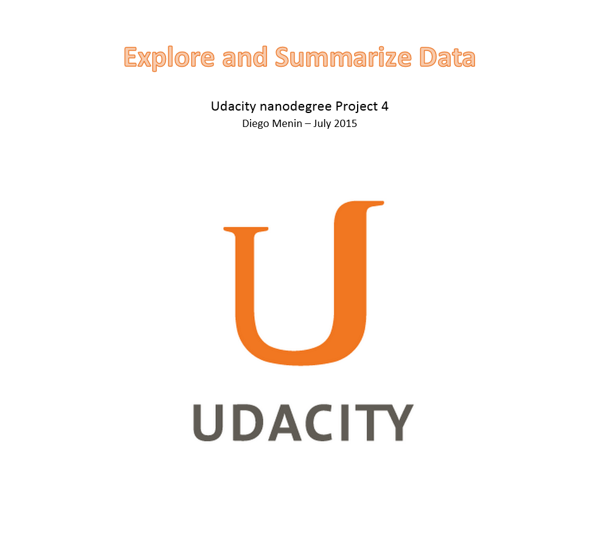

```{r, echo=FALSE, include=FALSE}
setwd("C:/git/UdacityDataAnalystNanoDegree/4_R/FinalProject/")
df<-read.csv("wineQualityWhites.csv")
library(plyr)
library(dplyr)
library(sfsmisc)
library(reshape2 )
library(ggplot2)
library(gridExtra)
library (corrplot)
library(caret)
library(rpart)
library(rpart.plot)

df<- df[!df$X == 2782, ]
df[,c("X")] <- list(NULL)

df$rating <- ifelse(df$quality <= 5, 'Bad', 
                    ifelse(df$quality <= 7, 'Average', 
                           ifelse(df$quality<=8,'Good', 
                                  'Excellent'
                           )
                    )
)

df$rating <- ordered(df$rating,levels = c('Bad', 'Average', 'Good', 'Excellent'))

df$quality <- as.factor(df$quality)

```





<center> <h1>Project Overview</h1> </center>

<br>

<p style='text-align: justify;'>
&nbsp;&nbsp;&nbsp;&nbsp;&nbsp;&nbsp;In this project I  will use the R language to apply exploratory data analysis techniques to a dataset containing information about chemical properties of Red Wines, trying to answer the guideline question: **"Which chemical properties influence the quality of red wines"**? Exploratory Data Analysis (EDA) is the numerical and graphical examination of data characteristics and relationships before formal, rigorous statistical analyses are applied.
</p>

<p style='text-align: justify;'>
&nbsp;&nbsp;&nbsp;&nbsp;&nbsp;&nbsp;The main goal of this project is to document an EDA process from scratch, threrefore, it is not to be seen (and won't be presented) as a "final report" you'd present to a possible stakeholder. **As the project description  states (and I quote):** *"Plots in this analysis do not need to be polished with labels, units, and titles; these plots are exploratory (quick and dirty). They should, however, be of the appropriate type and effectively convey the information you glean from them - You can iterate on a plot in the same R chunk, but you don't need to show every plot iteration in your analysis."* </p>

<p style='text-align: justify;'>
&nbsp;&nbsp;&nbsp;&nbsp;&nbsp;&nbsp; Towards the end of this report there will be a "Final Plots and Summary" section where I selected three plots from the analysis to polish and share with more insights.
</p>

<p style='text-align: justify;'>&nbsp;&nbsp;&nbsp;&nbsp;&nbsp;&nbsp;This project is divided in the following sections:

1. Dataset: Contains an overview of the dataset used and an explanation of each one of its variable. 
2. Exploratory Data Analysis: Where I explore at the data from several different angles.
2. Final Plots and Summary: Where three plots from the analysis were selected to be polished and shared with more insights.
3. Reflection:
</p>

<br>

## The DataSet

<p style='text-align: justify;'>
&nbsp;&nbsp;&nbsp;&nbsp;&nbsp;&nbsp;This tidy data set contains 1,599 observation  of red wines with 11 variables on it's chemical properties. The inputs include objective tests (e.g. PH values) and the output is based on sensory data (median of at least 3 evaluations made by wine experts). Each expert graded the wine quality between 0 (very bad) and 10 (very excellent).
</p>

<br>