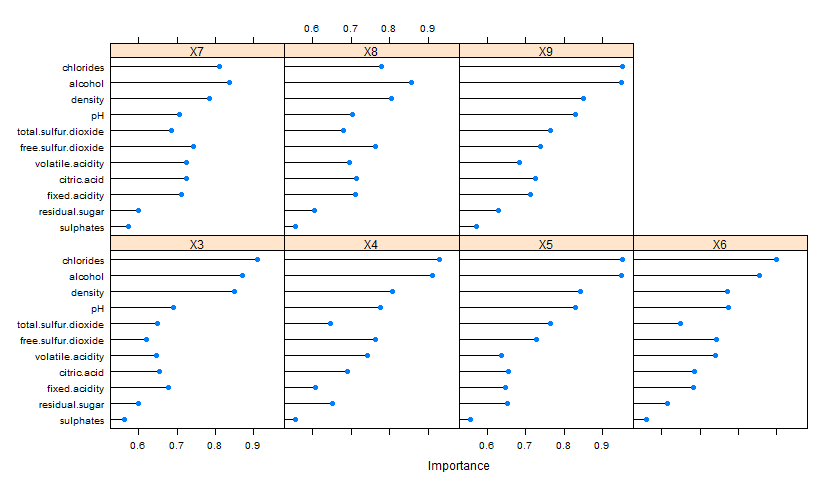

```{r, echo=FALSE, include=FALSE}
setwd("C:/git/UdacityDataAnalystNanoDegree/4_R/FinalProject/")
df<-read.csv("wineQualityWhites.csv")
library(plyr)
library(dplyr)
library(sfsmisc)
library(reshape2 )
library(ggplot2)
library(gridExtra)
library (corrplot)
library(caret)

df$quality <- as.factor(df$quality)


df<- df[!df$X == 2782, ]
df[,c("X")] <- list(NULL)

```


####Feature Selection:
<br>

<p style='text-align: justify;'>
&nbsp;&nbsp;&nbsp;&nbsp;&nbsp;&nbsp;Now that we've looked at how the variables are correlated with one another, let's try to find out how we can select a few of them to infer the quality of the Wine. To do that, I will run 3 different analysis.
</p>

<p style='text-align: justify;'>
&nbsp;&nbsp;&nbsp;&nbsp;&nbsp;&nbsp;First I'll use the findCorrelation function from the caret package to point out redundant features. That works from the principle that data can contain attributes that are highly correlated with each other and many methods perform better if highly correlated attributes are removed.
</p>

<p style='text-align: justify;'>
&nbsp;&nbsp;&nbsp;&nbsp;&nbsp;&nbsp;The function searches through a correlation matrix and returns a vector of integers corresponding to columns to remove to reduce pair-wise correlations. If two variables have a high correlation, the function looks at the mean absolute correlation of each variable and removes the variable with the largest mean absolute correlation.
</p>

<br>
```{r}
correlationMatrix <- cor(df[,1:11])
highlyCorrelated <- findCorrelation(correlationMatrix, cutoff=0.8, verbose = FALSE)
print (highlyCorrelated) 
```


<br>
<p style='text-align: justify;'>
&nbsp;&nbsp;&nbsp;&nbsp;&nbsp;&nbsp; So what this function is telling is that column 8 (density) is highly correlated with others and should not be consider as a feature. It actually makes sense, if you look at the correlation graph above, you'll see that density is highly correlated with residual sugar and total sulphur dioxide, so as log as we keepo these last two in the model, we should get a similar result.
</p>

<p style='text-align: justify;'>
&nbsp;&nbsp;&nbsp;&nbsp;&nbsp;&nbsp;Second, lets rank the feature by importance. 
The importance of features can be estimated from data by building a [Learning Vector Quantization (LVQ) model] (https://en.wikipedia.org/wiki/Learning_vector_quantization).
**Important: This code is not being evaluated because it takes around 5 minutes to run. I will instead print an image with the output: **
</p>
<br>


```{r, eval=FALSE}
control <- trainControl(method="repeatedcv", number=10, repeats=3)
# train the model
model <- train(quality~., data=df, method="lvq", preProcess="scale", trControl=control)
# estimate variable importance
importance <- varImp(model, scale=FALSE)
# plot importance
plot(importance)
```

<p style='text-align: justify;'>
The varImp is then used to estimate the variable importance, which is printed and plotted.
</p>


.


<p style='text-align: justify;'>
&nbsp;&nbsp;&nbsp;&nbsp;&nbsp;&nbsp;To finalize, I used a technique called Automatic feature selection. This method can be used to  identify those attributes that are and are not required to build an accurate model.A popular automatic method for feature selection provided by the caret R package is called Recursive Feature Elimination or RFE.
More details on this function can be found [here] (http://topepo.github.io/caret/featureselection.html).
</P>

<p style='text-align: justify;'>
&nbsp;&nbsp;&nbsp;&nbsp;&nbsp;&nbsp;A Random Forest algorithm is used on each iteration to evaluate the model. The algorithm is configured to explore all possible subsets of the attributes. 
**Important: This is also a very expensive code to run so I will again print an image with the output: **

```{r, eval=FALSE}
# define the control using a random forest selection function
control <- rfeControl(functions=rfFuncs, method="cv", number=10)
# run the RFE algorithm
results <- rfe(df[,1:11], df[,12], rfeControl=control)
# summarize the results
print(results)
```

?rfe
.


**Conclusion:**
