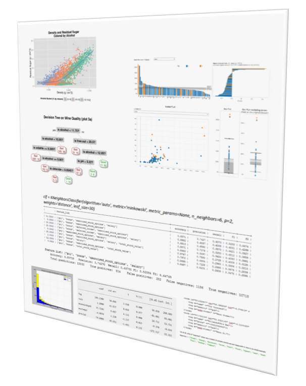

 
 

This folder contains the the final project for each  of the courses on the Nanodegree.

Click on the individual pdf file above for each project  visit equivalent folder for details\code of the project.
 
 

Project | Main Technologies
------------- | -------------
[P2: Intro to Data Science](https://github.com/dmenin/UdacityDataAnalystNanoDegree/tree/master/2_IntroDS)  | 
[P3: OpenStreetMaps Data Wrangling with MongoDB](https://github.com/dmenin/UdacityDataAnalystNanoDegree/tree/master/3_Mongo) |  
[P4: Explore and Summarize Data with R](https://github.com/dmenin/UdacityDataAnalystNanoDegree/tree/master/4_R) | 
[P5: Intro to Machine Learning with Python](https://github.com/dmenin/UdacityDataAnalystNanoDegree/tree/master/5_MachineLearning/PythonProject) |  

