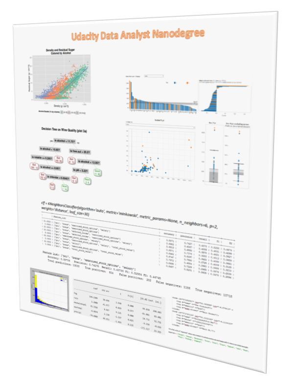

This folder contains the the final project for each  of the courses on the Nanodegree.

Click on each individual pdf file above to visualize the project and use the links below to check the code\more details for the desired project.
 
 

Project | Main Technologies
------------- | -------------
[P2: Intro to Data Science](https://github.com/dmenin/UdacityDataAnalystNanoDegree/tree/master/2_IntroDS)  | 
[P3: OpenStreetMaps Data Wrangling with MongoDB](https://github.com/dmenin/UdacityDataAnalystNanoDegree/tree/master/3_Mongo) |  
[P4: Explore and Summarize Data with R](https://github.com/dmenin/UdacityDataAnalystNanoDegree/tree/master/4_R) | 
[P5: Intro to Machine Learning with Python](https://github.com/dmenin/UdacityDataAnalystNanoDegree/tree/master/5_MachineLearning/PythonProject) |  
[P6: Data Visualization with D3.js](http://bl.ocks.org/dmenin/raw/97924f4c86232f7e3a84/) |  
[P7: Designing an AB Test](https://github.com/dmenin/UdacityDataAnalystNanoDegree/tree/master/7_ABTesting) |  

